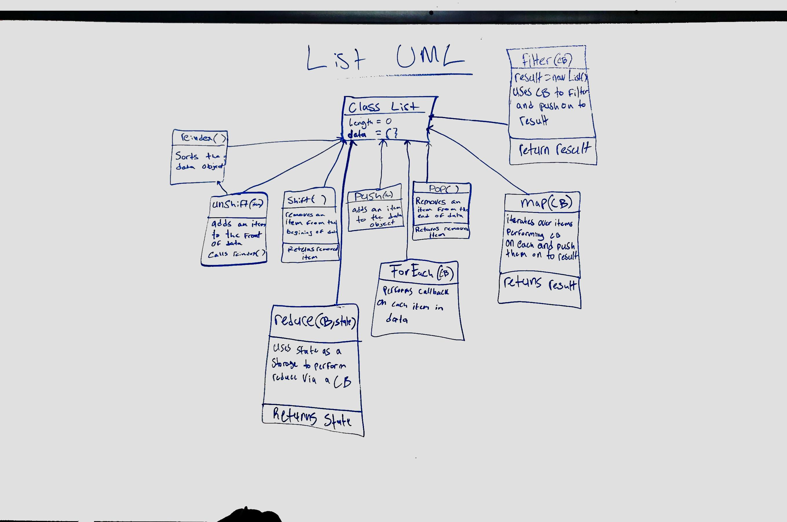

# LAB - 03

## Classes,Inheritance, Functional Programming

### Author: Martin Balke

### Lab Question:
I think that validator should export an instance of the class for testing and the actual class when being used in a real world application

### Links and Resources
* [submission PR](https://github.com/martinbalke-401-adavanced-js/401-lab-02/pull/2)
* [travis](https://www.travis-ci.com/martinbalke-401-adavanced-js/401-lab-02)

### Modules
#### `validator.js`
#### `validator class`

#### `list.js`

#### `vehicles.js`
##### `Vehicle class`

###### `drive() -> string`
Run on car class to return string 'moving forward'

###### `stop() -> string`
Run on car class to return string 'stopping'

#### `Car class`
Extends the Vehicle class

#### `Motorcycle class`
Extends the Vehicle class

###### `wheelie() -> string`
Run on car class to return string 'Wheee!'
  
#### Tests
* How do you run tests?  
NPM test
* What assertions were made?  
Vehicles class and vehicles constructor both function properly
* What assertions need to be / should be made?

#### UML
